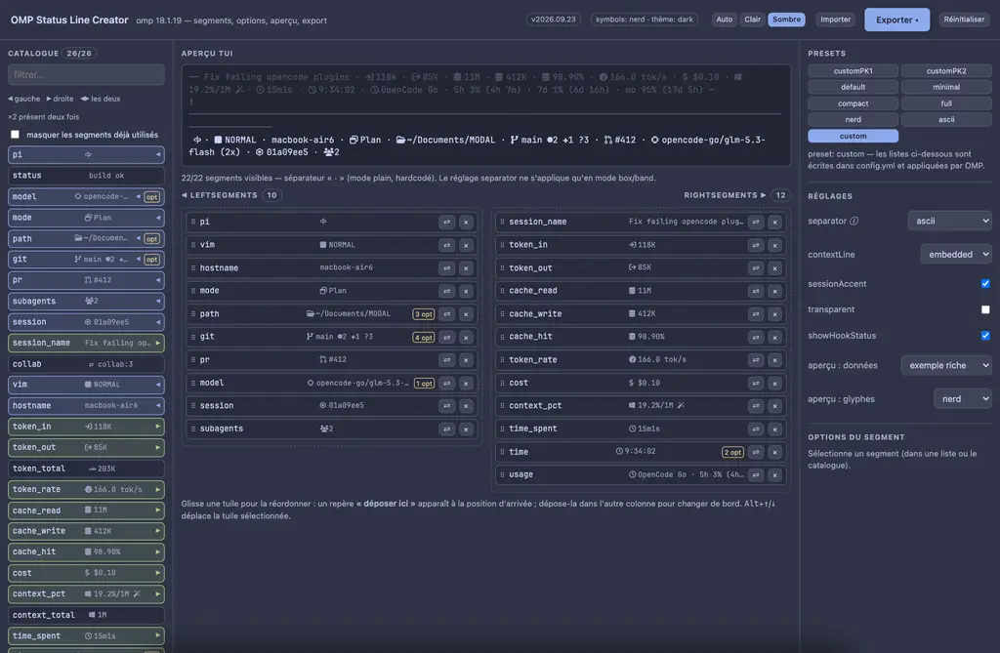
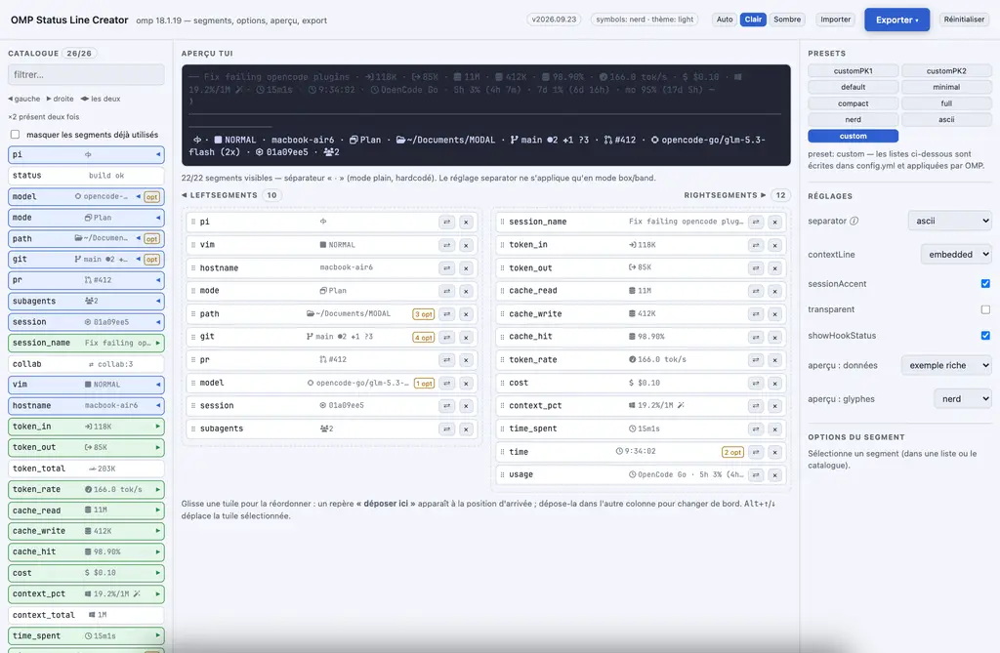

# OMP Status Line Creator

[🇫🇷 FR](README.md) · [🇬🇧 EN](README_en.md)


Compose Oh My Pi's status line with the mouse, preview it, and export the config — without editing YAML blind.



Light theme: 

## ✅ Features

- **Full catalog**: all 26 OMP segments (`pi`, `status`, `model`, `mode`, `path`, `git`, `pr`,
  `subagents`, `session`, `session_name`, `collab`, `vim`, `hostname`, `token_in`, `token_out`,
  `token_total`, `token_rate`, `cache_read`, `cache_write`, `cache_hit`, `cost`, `context_pct`,
  `context_total`, `time_spent`, `time`, `usage`) — description, sample rendering, left/right
  toggle, click to add.
- **Stock presets** copied verbatim (`default`, `minimal`, `compact`, `full`, `nerd`, `ascii`,
  `custom`) as pills, active preset highlighted — plus the **customPK1** and **customPK2** pills,
  your own selections. A local preset serialises to `preset: custom`, the only form OMP reads
  back.
- **Real options**: only `model`, `path`, `git` and `time` read options; the app edits them with
  OMP's defaults shown.
- **Faithful preview**: two rows like the TUI (metrics embedded in the top border, identity under
  the editor), three data sets — **`exemple riche` by default** (everything that can show up),
  `ma session type` (what you actually see) and `session vide` (which segments hide themselves) —
  with real glyphs for the `nerd` / `unicode` / `ascii` symbol presets.
- **Catalog with previews and usage state**: every row shows the **segment's actual rendering**
  (glyph of the selected preset + sample value, ellipsised when long), then a badge `◀`/`▶`/`◀▶`
  plus `×n` when already present, the `n/26` counter, a **“masquer les segments déjà utilisés”**
  filter and a hover detail (“utilisé : gauche ×2”).
- **Visible version**: the current version is always shown in the header (a `v…` badge); it comes
  from the hub `VERSION` and is rewritten into `index.html` by `python3 bump.py`
  (cross-check: `python3 bump.py --check`).
- **Displayed OMP version**: the subtitle shows the OMP build **the glyphs were extracted from**
  (read by `extract-symbols.py` from `omp --version`, written into `symbols.js`), with binary and
  date in the tooltip — no version baked into the HTML anymore.
- **Responsive layout**: three columns above 1240 px, two above 1040, stacked below; the two lists
  collapse to a single column under 780 px, where the drawer also takes the full width. No
  horizontal overflow from 420 px to 1500 px.
- **Two distinct surfaces**: `Exporter ▾` (primary action, `⌘E`) opens **export** only;
  `Importer` opens **import** only — same drawer, exclusive views, matching title.
- **Light / dark theme**: `Auto` (follows the system), `Clair`, `Sombre` — the dark theme is
  **Catppuccin Frappé** (`#303446`, text `#c6d0f5`, accent `#8caaee`), remembered in the browser.
  The preview deliberately stays terminal-dark — it mimics the TUI.
- **Two-column composer**: `leftSegments` on the left, `rightSegments` on the right, each tile
  showing its **actual rendering** (glyph + sample value). While dragging, a **dashed “déposer
  ici” marker** shows the exact landing position (the dragged tile turns translucent); dropping
  into the other column flips its side. `Alt`+`↑`/`↓` reorders the selected tile from the
  keyboard.
- **Automatic switches**: `preset` flips to `custom` as soon as a list or an option is touched
  (outside `custom`, OMP ignores the file's `leftSegments`/`rightSegments`/`segmentOptions`).
- **Guard rails**: empty-list warning (`[]` inherits no preset → empty bar), unknown segment ids
  reported on import.

## 🧠 Usage

1. Open `index.html`; the app starts from the current config (`Ma config actuelle`).
   Panels: catalog on the left, preview + lists in the middle, presets / settings / options on the right.
2. Click segments from the catalog, reorder by drag and drop, `⇄` flips side, `×` removes.
3. Check the preview, then open **Export / Import** in the header, pick the **Commandes** tab,
   copy and apply.
4. Restart the OMP session: **the status line is not hot-reloaded**.

## ⚙️ Settings

Exported settings are the OMP schema keys: `preset`, `separator`, `contextLine`, `sessionAccent`,
`transparent`, `showHookStatus`, `leftSegments`, `rightSegments`, `segmentOptions`.

Two facts verified in the binary, both surfaced in the UI:

- `separator` has **no effect** in `plain-*` display modes (the terminal one): the separator there
  is a hardcoded `·`; the setting only applies in `box`/`band` modes.
- the `usage` segment always renders the plan label ("OpenCode Go"): no option turns it off.

## 🧾 Commands

```bash
open index.html                 # run the app (no server, no dependency)
python3 extract-symbols.py      # regenerate symbols.js from the `omp` on PATH
python3 extract-symbols.py /path/to/omp
python3 bump.py                 # CalVer bump: hub VERSION + index.html constant + READMEs
python3 bump.py 2026.10.01      # force a version (syncs the four carriers)
python3 bump.py --check         # verify VERSION <-> UI <-> FR/EN READMEs

omp config get statusLine.leftSegments          # check what is applied
omp config set statusLine.preset custom         # what the “Commandes” tab produces
```

## 📦 Build & Package

No build: `index.html` + `symbols.js` are served as-is (opening the file is enough).
`symbols.js` is **generated** — do not edit it by hand. The `APP_VERSION` constant in `index.html`
is written by `bump.py` (it feeds the header version badge) — do not edit that either.
`favicon.svg` is the icon source; `icon.png`, `apple-touch-icon.png` and `favicon-32.png` are
derived from it (browser render).

## 🧪 Installation

Nothing to install: grab the folder from the hub (`tools/omp-statusline-creator/`) and open
`index.html`. The composer state lives in the browser's `localStorage`; the app never writes to
disk.

## 📋 See the [CHANGELOG](../../CHANGELOG.md) for the full history

## 🔗 Links

- [Oh My Posh Configurator](https://github.com/jamesmontemagno/ohmyposh-configurator) — the equivalent that inspired this tool.
- [omp.sh](https://omp.sh) — Oh My Pi.
- `omp://settings.md` and `omp://models.md` — docs embedded in the OMP app.

## 🚧 Known limits

- What OMP cannot do, the configurator does not invent: a preview option contradicting the real
  terminal rendering (hiding the `usage` segment's `5h/7d/mo` labels, for example) has no place
  here.
- The preview reproduces **the layout**, not ANSI escape codes: colors follow the `titanium`
  theme schematically.
- `nerd` glyphs need a Nerd Font installed to render; the `unicode` and `ascii` presets work
  everywhere.
- If Stencil adds or renames a segment, the catalog must be updated by hand
  (`extract-symbols.py` only refreshes glyphs).
